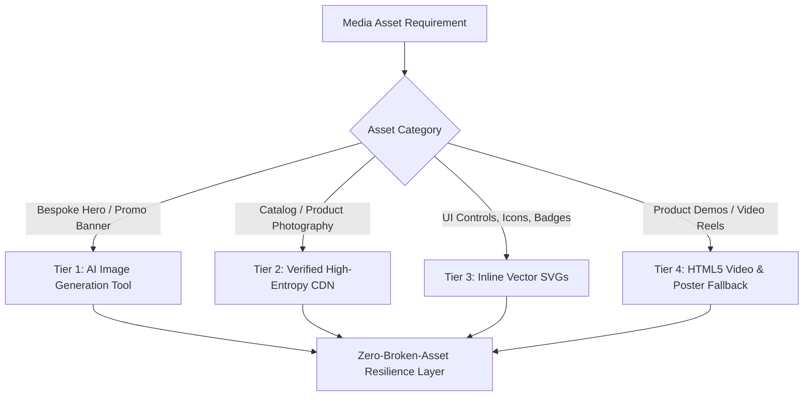

# Media & Asset Pipeline Reference

This guide specifies how autonomous agents handle images, videos, vector graphics, and motion assets when generating web replicas.

---

## 1. Zero-Placeholder Mandate

The replica must **never** use unrendered placeholders, broken hotlinks, or generic dummy boxes (e.g. `src="image.png"`, `src="#"`, or empty `src=""`). All media assets must be fully resolved, optimized, and resilient.

---

## 2. Multi-Tier Media Strategy



---

## 3. Tier Specifications

### Tier 1: AI-Generated Custom Assets (`generate_image`)
When the target requires unique promotional hero graphics, bespoke event banners (e.g., "Prime Big Deal Days", "Cyber Monday Gaming"), or custom product mockups:
1. Use the agent's `generate_image` tool with a descriptive prompt:
   - Example prompt: *"A sleek modern e-commerce promotional banner for high-end wireless headphones on a clean dark gradient background, dramatic studio lighting, 16:9 ratio, no text."*
2. Save the artifact to the replica project's `assets/images/` directory.
3. Reference the local image in the HTML/CSS markup.

### Tier 2: Verified High-Entropy Product Photography (CDN)
For diverse product catalogs and lifestyle showcases:
- Utilize high-resolution Unsplash CDN URLs with deterministic photo IDs and query parameters for sizing and quality:
  ```text
  https://images.unsplash.com/photo-[ID]?auto=format&fit=crop&w=800&q=80
  ```
- **Category-specific verified pools**:
  - *Electronics & Audio*: `photo-1505740420928-5e560c06d30e` (Headphones), `photo-1546868871-7041f2a55e12` (Smartwatch)
  - *Laptops & Desktops*: `photo-1517336714731-489689fd1ca8` (MacBook), `photo-1588872657578-7efd1f1555ed` (Setup)
  - *Home & Gaming*: `photo-1606813907291-d86efa9b94db` (Console), `photo-1550745165-9bc0b252726f` (Gaming PC)

### Tier 3: Pure Inline Vector Graphics (SVGs)
UI controls, status badges, and brand iconography must **never** be raster PNGs:
- **Search Icons, Carts, Chevrons, Flags**: Embedded as clean inline SVGs with `viewBox="0 0 24 24"` and `fill="currentColor"` to inherit parent typography colors.
- **Dynamic Star Ratings**: Implemented with SVG clip paths or multi-star layouts to support fractional ratings (e.g., 4.3 out of 5 stars) with pixel precision.
- **Prime & Best Seller Badges**: Built with inline SVG vectors or CSS clip-path ribbons for sharp rendering on Retina/HiDPI displays.

### Tier 4: HTML5 Video & Motion Media
For product video previews, hero banner reels, or demo clips:
- Use semantic `<video>` tags with required attributes for autoplay policies:
  ```html
  <video 
    class="product-preview-video"
    autoplay 
    loop 
    muted 
    playsinline 
    preload="metadata"
    poster="https://images.unsplash.com/photo-1505740420928-5e560c06d30e?w=800&q=80"
  >
    <source src="https://commondatastorage.googleapis.com/gtv-videos-bucket/sample/ForBiggerBlazes.mp4" type="video/mp4" />
    Your browser does not support the video tag.
  </video>
  ```
- **Mandatory Requirements for Videos**:
  - Must include `muted` attribute; unmuted autoplay is blocked by modern browsers.
  - Must include a high-resolution `poster` attribute matching the video frame to prevent layout shifts before the video stream loads.
  - Provide interactive hover-to-play or play/pause overlay controls.

---

## 4. Zero-Broken-Asset Resilience & Fallback Engine

To guarantee Gate 3 passes during self-validation (0 broken images, `naturalWidth > 0`):

1. **CSS Shimmer Loading State**:
   ```css
   .media-skeleton {
     background: linear-gradient(90deg, #f0f0f0 25%, #e0e0e0 50%, #f0f0f0 75%);
     background-size: 200% 100%;
     animation: mediaShimmer 1.5s infinite;
   }
   @keyframes mediaShimmer {
     0% { background-position: 200% 0; }
     100% { background-position: -200% 0; }
   }
   ```

2. **Global Fallback Handler (`js/app.js`)**:
   Attach an error listener to dynamically swap any failed external image for an inline SVG data URI:
   ```javascript
   function setupImageResilience() {
     const fallbackSvg = `data:image/svg+xml;charset=utf-8,${encodeURIComponent(`
       <svg xmlns="http://www.w3.org/2000/svg" width="400" height="400" viewBox="0 0 400 400" fill="#f3f3f3">
         <rect width="100%" height="100%"/>
         <circle cx="200" cy="180" r="40" fill="#d5d9d9"/>
         <path d="M120 280 L280 280 L230 210 L190 260 L160 230 Z" fill="#b0b5b5"/>
         <text x="200" y="320" font-family="sans-serif" font-size="14" fill="#888" text-anchor="middle">Product Image Preview</text>
       </svg>
     `)}`;

     document.querySelectorAll('img').forEach(img => {
       img.addEventListener('error', function () {
         if (this.src !== fallbackSvg) {
           this.src = fallbackSvg;
           this.classList.add('img-fallback');
         }
       });
     });
   }
   ```
