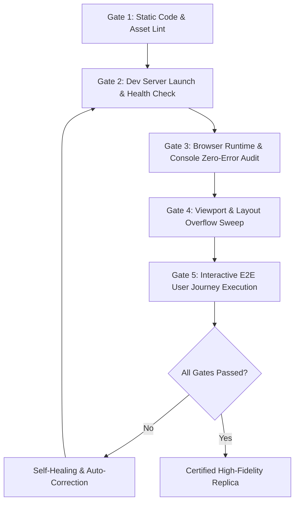

# Autonomous Multi-Modal Self-Validation & QA Protocol

An autonomous coding agent must never declare a web replica "complete" simply because code was written without syntax errors. The agent must independently start the dev server, navigate to the running application via a browser subagent or programmatic test runner, execute end-to-end user flows, inspect the DOM for layout defects, and audit browser console logs.

---

## 1. The 5-Gate Validation Pipeline



---

## 2. Gate Specifications & Failure Criteria

### Gate 1: Static Code, Fixture, & Multi-Layer Asset Verification
- **Code Syntax Check**: Verify all CSS, HTML, and JS files have valid syntax.
- **Multi-Layer Image Hygiene**:
  - **Layer A (Static HTML)**: Audits any static `` tags in `index.html` for empty `src`, missing `alt`, or dummy filenames.
  - **Layer B (JavaScript Data Fixtures)**: Scans `js/data.js`, `*.json`, and JavaScript files to audit all dynamically defined product assets (`primary`, `gallery`, `thumbnail`, `src`). Catches empty strings (`""`), placeholders (`"#"`), or undefined paths before runtime.
  - **Layer C (Hydrated DOM Analysis)**: When executed against `--url`, uses headless Chrome to capture the post-hydration rendered DOM and verify every dynamically mounted `` element in the live document.
- **Fail Condition**: Any empty image source, unverified placeholder, or missing image fixture triggers an immediate failure.

### Gate 2: Dev Server Health Check
- Run `npm run dev` (or simple HTTP server) using `run_command` with `IsDaemon=true` or appropriate background execution.
- Validate that the server responds with HTTP 200 within 5000ms:
  ```bash
  curl -s -o /dev/null -w "%{http_code}" http://localhost:5173/
  ```

### Gate 3: Runtime Console & Network Audit (Zero-Tolerance Policy)
Deploy `browser_subagent` to load `http://localhost:5173/` and evaluate the window error buffer:
```javascript
(() => {
  const errors = window.__agent_errors || [];
  const brokenImages = Array.from(document.querySelectorAll('img'))
    .filter(img => !img.complete || img.naturalWidth === 0)
    .map(img => img.src);

  return {
    errorCount: errors.length,
    errors: errors,
    brokenImages: brokenImages,
    hasBrokenImages: brokenImages.length > 0
  };
})();
```
- **Pass Threshold**: `errorCount === 0` AND `brokenImages.length === 0`.

### Gate 4: Viewport Responsiveness & Layout Overflow Sweep
Automate inspection across three distinct viewport dimensions:
1. **Desktop**: `1440 x 900`
2. **Tablet**: `768 x 1024`
3. **Mobile**: `375 x 812`

At each viewport, execute the **Horizontal Overflow Diagnostic**:
```javascript
(() => {
  const docWidth = document.documentElement.offsetWidth;
  const scrollWidth = document.documentElement.scrollWidth;
  const overflows = [];

  if (scrollWidth > docWidth) {
    document.querySelectorAll('*').forEach(el => {
      const rect = el.getBoundingClientRect();
      if (rect.right > docWidth) {
        overflows.push({
          tag: el.tagName,
          id: el.id,
          className: el.className,
          right: rect.right,
          docWidth: docWidth
        });
      }
    });
  }

  return {
    hasHorizontalScrollbar: scrollWidth > docWidth,
    scrollWidth,
    docWidth,
    overflowCulprits: overflows.slice(0, 5)
  };
})();
```
- **Pass Threshold**: `hasHorizontalScrollbar === false` on all three viewports.

### Gate 5: Interactive E2E User Journey Execution
The agent must verify that all dynamic state loops function end-to-end:

| Step | User Action | Expected Observable State Change |
| :--- | :--- | :--- |
| **5.1** | Type `"headphones"` in search bar | Product grid filters dynamically; search counter updates; result title displays query. |
| **5.2** | Click `"Prime"` checkbox in sidebar | Only items with `isPrime === true` remain visible in the grid. |
| **5.3** | Click on a product card | Application transitions to Product Detail Page (PDP); breadcrumbs update; gallery displays selected item. |
| **5.4** | Click gallery secondary thumbnail | Main hero image switches smoothly to the thumbnail preview. |
| **5.5** | Click `"Add to Cart"` button | Cart badge increments from `0` to `1`; slide-over cart drawer animates into view; subtotal displays item price. |
| **5.6** | Increase quantity in drawer to `2` | Subtotal doubles accurately in real-time. |
| **5.7** | Refresh the browser page (`F5`) | Cart persists with count `2` and correct items via `localStorage`. |
| **5.8** | Press `Escape` key | Cart drawer closes gracefully; focus returns to main content. |

---

## 3. Automated Validation Script (`scripts/audit_replica.js`)

Autonomous agents can run the pre-configured Node.js audit script directly in their workflow:
```bash
node scripts/audit_replica.js --url http://localhost:5173 --verbose
```
If any check fails, the script outputs structured JSON diagnosing the root cause so the agent can self-correct immediately.
